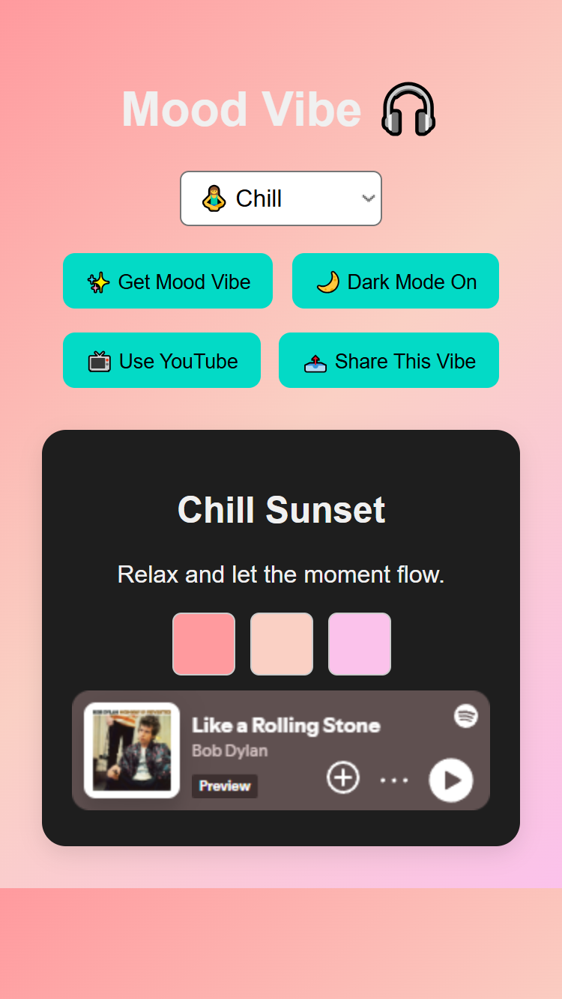

---

````markdown
# 🎨 Mood Vibe PWA

A fun, animated **Progressive Web App** (PWA) that gives you a random "mood vibe" — like _Chill Sunset_ or _Energetic Neon_ — complete with:
- 🎨 A matching color palette
- 💬 A motivational quote
- 🎧 A vibe-matching music link (YouTube/Spotify)
- 🌙 Dark mode toggle
- 📱 Share button (Web Share API + Twitter fallback)
- ⚡ Smooth animations
- 📦 Installable on any device (PWA-ready)

> _"A micro-dose of personalized inspiration in one tap!"_

---

## ✨ Features

- 🔁 **Random mood generator** with a wide range of vibes  
- 🌈 **Color transitions** to match mood themes  
- 📖 **Short motivational quotes** to uplift your moment  
- 🎵 **Song recommendations** (YouTube + Spotify toggle)  
- 🌙 **Dark mode / Light mode** toggle  
- 🪄 **Smooth fade & scale animations**  
- 📤 **Share your vibe** to X (Twitter) or via native mobile share  
- 💾 **PWA support** – install it like an app  

---

## 📸 Demo Preview

| Light Mode ☀️ | Dark Mode 🌙 |
|---------------|--------------|
| 

|


---

## 🛠️ Tech Stack

- HTML5  
- CSS3 (with animations & gradients)  
- JavaScript (vanilla)  
- PWA (manifest + service worker)  
- Web Share API  

---

## 🧩 Folder Structure

```bash
mood-vibe-pwa/
├── index.html
├── style.css
├── script.js
├── manifest.json
├── service-worker.js
└── assets/
    ├── icons/
    └── preview/
````

---

## 🧠 How It Works

Each time you tap "Get Mood Vibe":

* A **random mood** is picked from an array
* The background and UI **animate** to match
* A **motivational quote** and **music link** appear
* You can **share the vibe** or switch **dark/light themes**

---

## 📲 How to Install

1. Open the web app in your browser
2. Tap **"Add to Home Screen"** (on mobile) or **"Install"** (on desktop)
3. Enjoy inspiration anytime ✨

---

## 🧪 Coming Soon

* 🎯 Save/share favorite moods
* 📸 Capture vibe as image for stories
* 🧠 Mood tracking over time
* 🛠 Custom vibe creation

---

## 📄 License
  
MIT License — free to use, modify, and share.


---

## 🙌 Author

Made with 💜 by [Ndifreke Bassey](https://github.com/NdifrekeBassey)
*“Keep soaring higher — innovation knows no limits!”*

```

